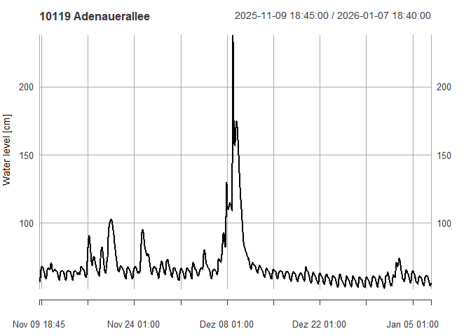

<!-- README.md is generated from README.Rmd. Please edit that file -->

# NRWgauges

<!-- badges: start -->

[](https://github.com/dimfalk/NRWgauges/actions/workflows/R-CMD-check.yaml)
[](https://codecov.io/gh/dimfalk/NRWgauges)
<!-- badges: end -->

NRWgauges aims to grant easy access to gauge (meta-)data published on
distributed web-based platforms by various water management associations
in North Rhine-Westphalia, Germany.

As of today, the following platforms can be harvested:

- pegel.eglv.de (Emschergenossenschaft / Lippeverband)

## Installation

You can install the development version of NRWgauges with:

``` r
# install.packages("devtools")
devtools::install_github("dimfalk/NRWgauges")
```

and load the package via

``` r
library(NRWgauges)
#> 0.3.10
```

## Basic example: EGLV

### Get gauge locations and metadata

``` r
# fetch all available gauges
gauges <- get_eglv_gauges()
gauges
#> Simple feature collection with 122 features and 6 fields
#> Geometry type: POINT
#> Dimension:     XY
#> Bounding box:  xmin: 336929 ymin: 5701285 xmax: 433191 ymax: 5733623
#> Projected CRS: ETRS89 / UTM zone 32N
#> # A tibble: 122 × 7
#>    id    name             waterbody has_current_waterlevel has_current_discharge
#>    <chr> <chr>            <chr>     <lgl>                  <lgl>                
#>  1 10104 Econova Allee    Berne     TRUE                   TRUE                 
#>  2 10135 E Posener Straß… Borbecke… TRUE                   FALSE                
#>  3 11038 HRB Borbecker M… Borbecke… TRUE                   FALSE                
#>  4 12036 HRB Borbecker M… Borbecke… TRUE                   FALSE                
#>  5 10085 Nöggerathstraße  Borbecke… TRUE                   FALSE                
#>  6 10140 BOT Gungstraße,… Boye      TRUE                   FALSE                
#>  7 10141 Braukstraße, B2… Boye      TRUE                   FALSE                
#>  8 10139 GLA Brücke Welh… Boye      TRUE                   FALSE                
#>  9 22049 An den Höfen, H… Bruckhau… TRUE                   FALSE                
#> 10 21119 HÜN HRB Zur alt… Bruckhau… TRUE                   FALSE                
#> # ℹ 112 more rows
#> # ℹ 2 more variables: has_current_velocity <lgl>, geometry <POINT [m]>

# ... eventually filter the dataset to the objects you're interested in
gauge <- gauges |> dplyr::filter(id == "10119")
gauge
#> Simple feature collection with 1 feature and 6 fields
#> Geometry type: POINT
#> Dimension:     XY
#> Bounding box:  xmin: 367059.8 ymin: 5712147 xmax: 367059.8 ymax: 5712147
#> Projected CRS: ETRS89 / UTM zone 32N
#> # A tibble: 1 × 7
#>   id    name          waterbody has_current_waterlevel has_current_discharge
#> * <chr> <chr>         <chr>     <lgl>                  <lgl>                
#> 1 10119 Adenauerallee Emscher   TRUE                   FALSE                
#> # ℹ 2 more variables: has_current_velocity <lgl>, geometry <POINT [m]>
```

### Get (extended) metadata for selected gauges

``` r
get_eglv_meta(gauge)
#> Simple feature collection with 1 feature and 8 fields
#> Geometry type: POINT
#> Dimension:     XY
#> Bounding box:  xmin: 367059.8 ymin: 5712147 xmax: 367059.8 ymax: 5712147
#> Projected CRS: ETRS89 / UTM zone 32N
#> # A tibble: 1 × 9
#>   id    name  operator waterbody municipality river_km catchment_area level_zero
#> * <chr> <chr> <chr>    <chr>     <chr>           <dbl>          <dbl>      <dbl>
#> 1 10119 Aden… EG       Emscher   Gelsenkirch…     36.4           481.       30.8
#> # ℹ 1 more variable: geometry <POINT [m]>
```

### Get available measurements for selected gauges

``` r
# fetch water level measurements
meas <- get_eglv_measurements(gauge)[[1]]
meas
#>                     Wasserstand
#> 2025-11-09 20:15:00          58
#> 2025-11-09 20:20:00          58
#> 2025-11-09 20:25:00          58
#> 2025-11-09 20:30:00          58
#> 2025-11-09 20:35:00          58
#> 2025-11-09 20:40:00          58
#> 2025-11-09 20:45:00          58
#> 2025-11-09 20:50:00          58
#> 2025-11-09 20:55:00          58
#> 2025-11-09 21:00:00          58
#>                 ...            
#> 2026-01-07 19:25:00          57
#> 2026-01-07 19:30:00          57
#> 2026-01-07 19:35:00          57
#> 2026-01-07 19:40:00          57
#> 2026-01-07 19:45:00          57
#> 2026-01-07 19:50:00          57
#> 2026-01-07 19:55:00          58
#> 2026-01-07 20:00:00          58
#> 2026-01-07 20:05:00          58
#> 2026-01-07 20:10:00          58

class(meas)
#> [1] "xts" "zoo"

plot(meas, main = "10119 Adenauerallee", ylab = "Water level [cm]")
```


